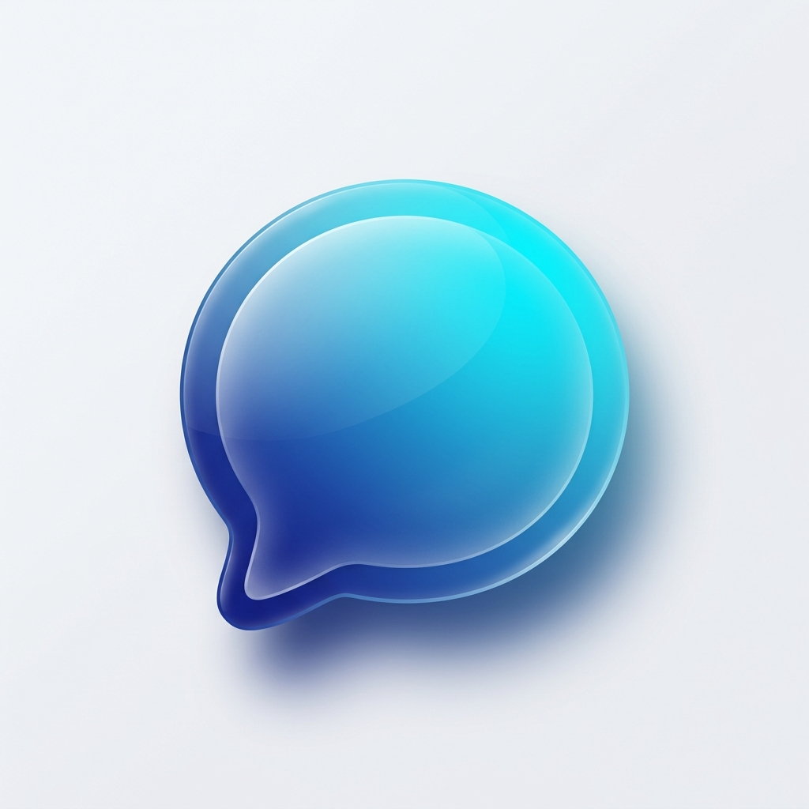

# Antigravity Chat 🚀

A premium, feature-rich real-time chat application built with **Flutter** and **Firebase**. This project demonstrates a production-grade implementation of modern chat functionalities with a focus on performance, aesthetics, and user experience.



## ✨ Features

### 💬 Messaging
- **Real-time Chat**: Instant 1-on-1 and Group messaging powered by Firestore.
- **Swipe-to-Reply**: Intuitive right-to-left swipe gesture to reply to specific messages.
- **Forwarding**: Multi-select and forward messages to multiple contacts or groups.
- **Read Receipts**: Visual indicators (double blue ticks) when messages are seen.
- **Typing Indicator**: Real-time "typing..." status in chat headers.
- **Unread Badges**: Dynamic unread message counts in the chat list.

### 📁 Multimedia Support
- **Images & Videos**: High-performance media sharing via Cloudinary.
- **Voice Notes**: Integrated audio recorder and player for voice messages.
- **Full-screen Viewer**: Immersive media viewing experience with zoom and playback controls.

### 👥 Groups
- **Group Creation**: Create groups with custom names and profile photos.
- **Group Profile**: Manage group members and view group details.
- **Unified List**: Both group and individual chats are seamlessly displayed in a single conversation list.

### ⚙️ Profile & Settings
- **Profile Customization**: Update your display name and profile picture instantly.
- **Local Settings**: Persist preferences like Read Receipts and Notifications using Shared Preferences.
- **Dark Mode Support**: Fully responsive UI that adapts to system theme settings.

### 🎨 Design & UX
- **Animated Splash Screen**: A beautiful, branded entry experience.
- **Modern UI**: Follows premium design principles with glassmorphism, smooth gradients, and micro-animations.
- **Responsive Layout**: Optimized for various screen sizes and orientations.

## 🛠 Tech Stack

- **Frontend**: Flutter (Dart)
- **State Management**: [Riverpod](https://riverpod.dev/) (3.x)
- **Backend**: 
  - [Firebase Auth](https://firebase.google.com/docs/auth) (Authentication)
  - [Cloud Firestore](https://firebase.google.com/docs/firestore) (NoSQL Real-time DB)
  - [Cloudinary](https://cloudinary.com/) (Media Storage & Optimization)
- **Local Storage**: Shared Preferences
- **Architecture**: Clean Architecture with Repository Pattern

## 🚀 Getting Started

### Prerequisites
- Flutter SDK (latest version)
- A Firebase project
- A Cloudinary account

### Installation

1. **Clone the repository:**
   ```bash
   git clone https://github.com/PraJwaL-SDE/chat_app.git
   ```

2. **Install dependencies:**
   ```bash
   flutter pub get
   ```

3. **Firebase Configuration:**
   - Add your `google-services.json` (Android) and `GoogleService-Info.plist` (iOS) to the respective directories.
   - Update the `FirebaseOptions` in `lib/main.dart` with your project credentials.

4. **Run the app:**
   ```bash
   flutter run
   ```

## 📸 Screenshots

*(Add your screenshots here)*

---

Developed with ❤️ by [PraJwaL-SDE](https://github.com/PraJwaL-SDE)
